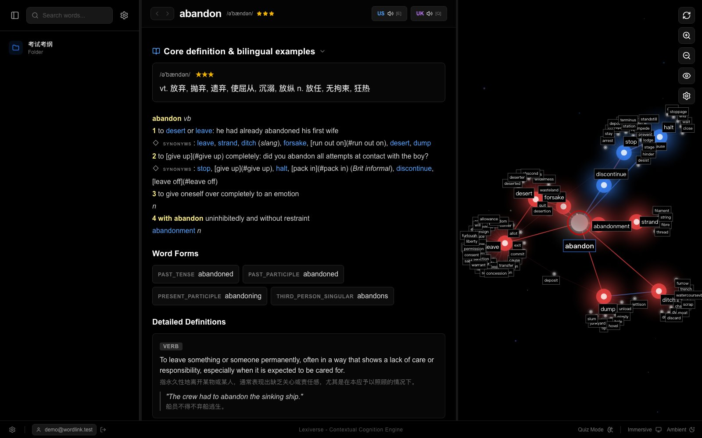
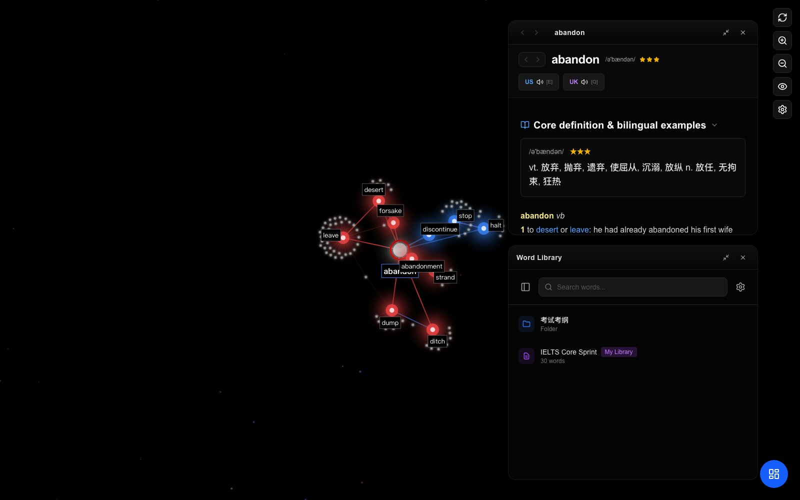
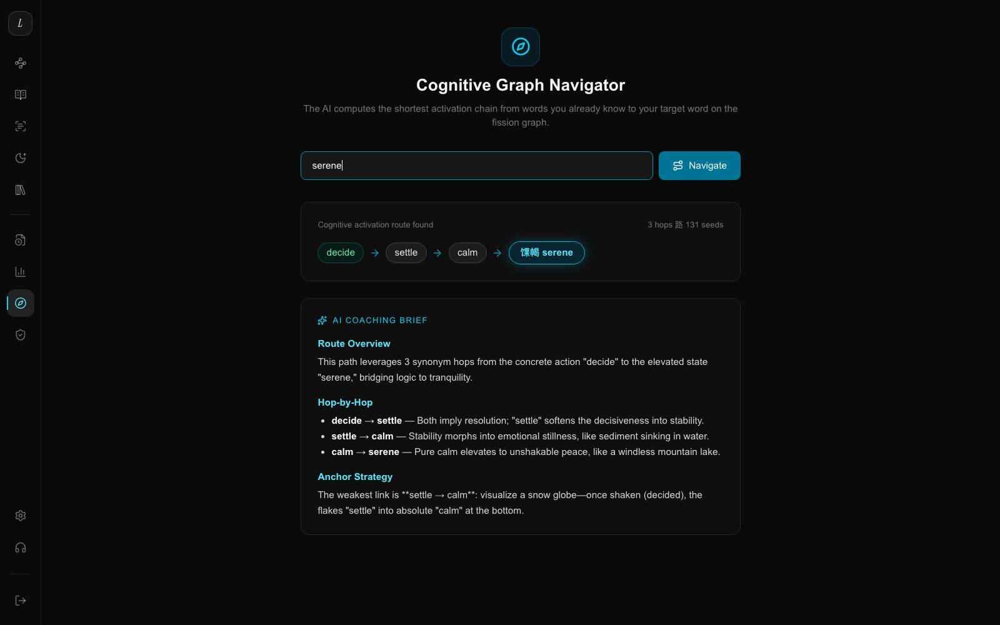
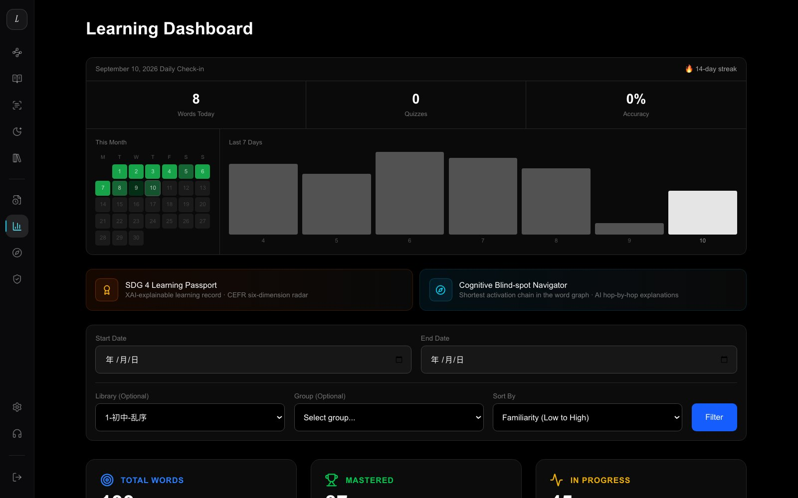
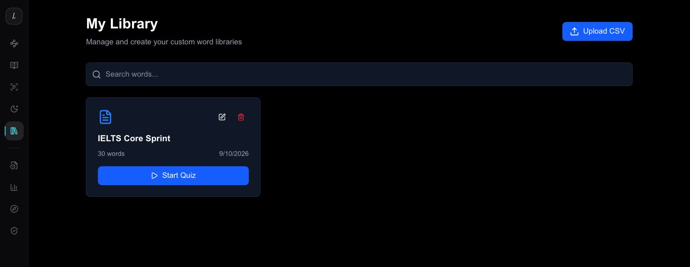

<div align="center">

# 🌌 WordLink — Lexiverse 语宙

**AI-powered vocabulary learning. A fine-tuned 1.5B model that runs offline in your browser.**

[](https://nextjs.org)
[](https://react.dev)
[](https://github.com/QwenLM/Qwen2.5)
[](docs/模型训练详细报告.md)

*Stunning cognitive topology. Blazing retention. Built for SDG 4.*

[Features](#-features) · [Benchmarks](#-measured-results) · [Architecture](#-how-it-works) · [Quick Start](#-quick-start) · [中文简介](#-中文简介)

</div>



> ⚡ **No ads. No subscription. Works offline.** The vocabulary model runs *in your browser* via WebGPU — your learning data never leaves your device.

---

## ✨ Features

<table>
<tr>
<td width="50%">

### 🪐 星图工作台 · Study Workspace
Word library, word details and the **fission graph** in a three-column workspace — pick any word and its synonym network unfolds in a force-directed star map.

</td>
<td width="50%">

### 🧠 AI Quiz · 智能测验
Choice / spelling / recall modes driven by a memory-strength model. Every answer updates your forgetting curve in real time.

</td>
</tr>
<tr>
<td width="50%">

### 🌍 Contextual Reading · 语境精读
Graded articles with click-to-define on any word — reading *is* your review session.

</td>
<td width="50%">

### 🛂 XAI Learning Passport · 学习护照
An explainable AI narrative of everything you've learned: CEFR positioning, cognitive radar, growth trajectory.

</td>
</tr>
</table>

More: **Ambient screensaver listening** (four-season soundscapes synthesized live in Web Audio) · **Cognitive Navigator** (shortest activation path to your target exam) · **My Libraries** (built-in + custom word books) · **中英双语界面** · dark mode.

<p align="center">
  
  
</p>
<p align="center">
  
  
</p>

---

## 📊 Measured Results

All numbers are **real measurements** from our 90-question benchmark (greedy decoding) — target-word injection into CEFR-constrained stories, scored on real model outputs. Full report: [`outputs/eval/BENCHMARK_RESULTS.md`](outputs/eval/BENCHMARK_RESULTS.md).

| Model | Target-word hit ↑ | CEFR violation ↓ | JSON compliance ↑ | FKGL |
|---|---:|---:|---:|---:|
| Qwen2.5-1.5B-Instruct (before fine-tuning) | 63.06% | 0.17% | 82.22% | 13.5 |
| **+ SFT** (2,045 diverse stories) | **88.06%** | **0.01%** | **100%** | **9.8** |
| **+ DPO** (real-failure negatives) | 87.78% | **0.01%** | **100%** | 9.9 |
| Qwen2.5-7B-Instruct (zero-shot) | 39.72% | 0.07% | **0%** | — |
| DeepSeek-V3 zero-shot (teacher) | 97.78% | 0.01% | 100% | 10.4 |
| Teacher / Oracle upper bound | 98.33% | 0.22% | 100% | — |

> 💡 Fine-tuning the small model: **+25pp on the same 1.5B**, matching the teacher's upper bound — while a *larger* model without fine-tuning collapses (39.72% hit, 0% valid JSON). Constraint-following is trained, not bought with parameters.

---

## 🏗 How It Works

**Neuro-symbolic architecture** — algorithms handle scheduling, neural models handle generation:

```
┌───────────────────────────┐        ┌───────────────────────────────┐
│  Symbolic Engine (确定性)  │        │  Neural Engine (生成)          │
│  · FSRS-6 forgetting curve │        │  · Edge 1.5B (browser, WebGPU) │
│  · Levenshtein scoring     │  ⇄     │  · CEFR-constrained stories    │
│  · RME word matching       │        │  · Real-failure DPO negatives  │
└───────────────────────────┘        └───────────────────────────────┘
      │ free · explainable · offline         │ infinite · personal
      ▼                                      ▼
  "算法管调度 —— 每毫秒、可解释"        "AI 管生成 —— 把复习词写进今天的故事"
```

The loop: **FSRS computes what you should review tomorrow → the fine-tuned model writes it into today's story → reading the story surfaces new words → your memory model updates.**

Training pipeline: `Data factory (generate + 5-gate filter) → SFT → DPO (real-failure negatives) → Auto-benchmark → 4-bit edge export` — full report in [`docs/模型训练详细报告.md`](docs/模型训练详细报告.md).

---

## 🚀 Quick Start

```bash
# 1. Prerequisites: Node.js ≥ 20, Docker
git clone https://github.com/orionsheep/wordlink.git
cd wordlink
npm install

# 2. Start PostgreSQL (business data)
docker compose up -d

# 3. Configure environment (see docs/部署与运行指南.md for every variable)
#    DATABASE_URL is required; auth / AI keys optional

# 4. Run
npm run dev            # → http://localhost:3000
```

> Demo experience: sign in with `demo@wordlink.test / Demo2026!` (pre-loaded with 180 days of learning data), or browse public pages without an account. Full deployment guide: [`docs/部署与运行指南.md`](docs/部署与运行指南.md).

## 🧠 Train Your Own

The complete training pipeline is in [`model_training/`](model_training/):

```bash
python model_training/08_generate_diverse_corpus.py   # data factory (LLM teacher + 5-gate filter)
python model_training/02_train_sft.py                 # SFT
python model_training/03_train_dpo.py                 # DPO with real-failure negatives
python model_training/eval_real.py --backend local    # benchmark
```

Full report: [`docs/模型训练详细报告.md`](docs/模型训练详细报告.md)

---

## 🇨🇳 中文简介

**Lexiverse 语宙** 是一个 AI 驱动的英语词汇学习平台：自己微调的 1.5B 模型直接运行在浏览器中（WebGPU 4-bit 量化，~950MB 首次下载后永久离线），把你的到期复习词实时写进今天阅读的故事里。遗忘调度由可解释的 FSRS-6 数学引擎完成，推理零边际成本，学生数据永不出浏览器。核心实测：微调后生词注入命中 88.06%、JSON 合规 100%、CEFR 越界 0.01%。

## 📁 Repository Map

```
├── src/app/            # Next.js App Router pages & API routes
├── src/components/     # UI components (welcome landing, study workspace, ambient…)
├── model_training/     # SFT / DPO / corpus factory / benchmark scripts
├── data/               # word libraries & training corpora (jsonl)
├── outputs/eval/       # benchmark metrics & per-question predictions
├── docs/               # training report, deployment guide, media specs
└── public/             # images & demo videos
```

---

<div align="center">

**Built for [UNU Macau · AI for SDGs 2026](https://unu.edu/macau)** — AI for Education (SDG 4)

*Stunning cognitive topology. Blazing retention.*

</div>
